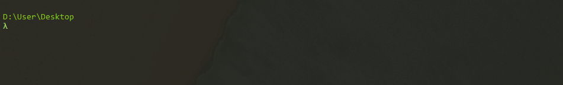
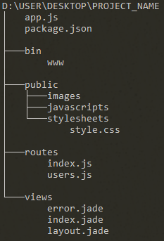
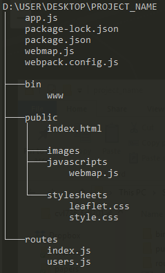
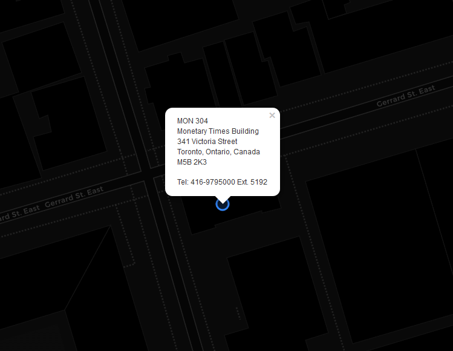

# Tutorial: Creating an Express Node.js Server for a Simple Leaflet Webmap

Richard Wen <rwen@ryerson.ca>  
  
A tutorial for creating a leaflet webmap with express in Node.js

## Step 1. Install Software

1. Install [Node.js](https://nodejs.org/)
2. Install [express-generator](https://www.npmjs.com/package/express-generator) globally `-g` with [npm](https://docs.npmjs.com/cli/install)
3. Check that the `express` command works by using the `-h` help option

```
npm install -g express-generator
express -h
```

## Step 2. Create an express Project

Using the installed software, we can then create an express project folder with the `express` command. This folder will contain all the code required to serve our web pages as Hyper Text Markup Lanauge (HTML)[https://www.w3schools.com/html/] files.

### 2.1 Open a Command Line Interface (CLI)

Open a [command line interface](https://en.wikipedia.org/wiki/Command-line_interface) or terminal:



### 2.2 Generate a Project Folder with the express Command

Create an express project with the `express` command, replacing `<project_name>` with the name of your project:

* `<project_name>` should be a valid folder name with no spaces and starting with a letter

```
express <project_name> --no-view
```

### 2.3 Inspect the Project Folder Structure

A folder named `<project_name>` will be created with the following structure inside (note that the structure may change with `express --version` that is not 4.16.0):



* `app.js`: JavaScript file that contains code needed to create and run your express server or application
* `package.json`: [JSON](https://www.json.org/) structured [package file](https://docs.npmjs.com/files/package.json) holding all the dependencies and information about your project (can be modified with the [npm](https://docs.npmjs.com/cli/npm) command)
* `/bin`: folder containing executable code
	* `www`: executable file for starting the server
* `/public`: folder containing files served to the client side or front end
	* `index.html`: landing page served to the clients
	* `/images`: folder containing images to be served to clients
	* `/javascripts`: folder containing [JavaScript](https://www.w3schools.com/js/) code files to be served to clients
	* `/stylesheets`: folder containing [Cascading Style Sheets (CSS)](https://www.w3schools.com/css/) files to be served to clients
		* `style.css`: CSS file used to define how your web page elements will look
* `/routes`: folder containing JavaScript files for defining [routes](https://expressjs.com/en/guide/routing.html) that direct how the server responds to client requests (these files are often used in file `app.js`)
	* `index.js`: defines the response to client requests at `<address>/` depending on how it is used in file `app.js`
	* `users.js`: defines the response to client requests at `<address>/users` depending on how it is used in file `app.js`

## Step 3. Install express Dependencies

After generating our project folder, we need to install the required Node.js package dependencies for express.

### 3.1 Change Directory

Move into the project folder, where `<project_name>` is the name of the folder you created in [Step 2.2](#step-22-generate-a-project-folder-with-the-express-command):

```
cd <project_name>
```

### 3.2 Install Package Dependencies

Inside your `<project_name>` folder, install the dependencies with `npm`, where a folder called `/node_modules` will contain the code files of the installed dependencies:

```
npm install
```

## Step 4. Creating the leaflet Webmap Code

We can then create a JavaScript file that stores the code for our leaflet web map. Keep in mind that this code requires Node.js which is only available inside the server or back end.

### 4.1 Install leaflet as a Dependency

Install [leaflet](https://www.npmjs.com/package/leaflet) with `npm install` and save it as a dependency `--save` to `package.json`:

```
npm install --save leaflet
```

### 4.2 Create a leaflet JavaScript File

Create a file for the leaflet map by sending an empty line with `echo.` into `>` a file called `webmap.js`:

```
echo. > webmap.js
```

### 4.3 Add leaflet Code to the File

Open `webmap.js` for editing and add the following JavaScript code:

```javascript
// Import the leaflet package
var L = require('leaflet');

// Creates a leaflet map binded to an html <div> with id "map"
// setView will set the initial map view to the location at coordinates
// 13 represents the initial zoom level with higher values being more zoomed in
var map = L.map('map').setView([43.659752, -79.378161], 20);

// Adds the basemap tiles to your web map
// Additional providers are available at: https://leaflet-extras.github.io/leaflet-providers/preview/
L.tileLayer('https://{s}.basemaps.cartocdn.com/dark_all/{z}/{x}/{y}{r}.png', {
	attribution: '&copy; <a href="http://www.openstreetmap.org/copyright">OpenStreetMap</a> &copy; <a href="https://carto.com/attributions">CARTO</a>',
	subdomains: 'abcd',
	maxZoom: 21
}).addTo(map);

// Adds a popup marker to the webmap for GGL address
L.circleMarker([43.659752, -79.378161]).addTo(map)
	.bindPopup(
		'MON 304<br>' + 
		'Monetary Times Building<br>' +
		'341 Victoria Street<br>' + 
		'Toronto, Ontario, Canada<br>' +
		'M5B 2K3<br><br>' + 
		'Tel: 416-9795000 Ext. 5192'
	)
	.openPopup();
```

### 4.4 Create a HTML Divider for the leaflet Webmap

Notice that in the code of [Section 4.3](#43-add-leaflet-code-to-the-file), a divider `<div>` with the id `map` is required to create the leaflet webmap. 
  
Open `public/index.html` for editing and replace everything with the following HTML code:

* Notice that we added a divider with id `map` to create our leaflet webmap in
* Note that the width and height of the divider must be set for the webmap to show (we will do this later in a CSS file)

```html
<html>

<head>
	<meta charset="utf-8"/>
	<title>GGL Leaflet Webmap Tutorial</title>
	<link rel="stylesheet" href="stylesheets/style.css">
</head>

<body>
	<div id="map"></div>
</body>


</html>
```

## Step 5. Building the leaflet Webmap Code for the Client Side

Since `webmap.js` is not served to the client side and requires the server's backend software to run, it needs to be built into client side code and stored inside the `public` folder in order to display in the browser.

### 5.1 Install browserify

Install [browserify](https://www.npmjs.com/package/browserify) globally `-g` with `npm install`:

```
npm install -g browserify
```

### 5.2 Bundling the leaflet Code

After installing browserify, we can build and bundle the leaflet code from `webmap.js` into `public/javascripts/webmap.js` with the `browserify` command:

```
browserify webmap.js -o public/javascripts/webmap.js
```

For convenience, we can add the browserify bundling command under `scripts -> build` in the file `package.json`:

```json
{
  "name": "project-name",
  "version": "0.0.0",
  "private": true,
  "scripts": {
    "start": "node ./bin/www",
	"build": "browserify webmap.js -o public/javascripts/webmap.js"
  },
  "dependencies": {
    "cookie-parser": "~1.4.3",
    "debug": "~2.6.9",
    "express": "~4.16.0",
    "leaflet": "^1.4.0",
    "morgan": "~1.9.0"
  }
}
```

This allows us to run the same command for bundling the leaflet code with a more convenient call everytime we make changes to `webmap.js`:

```
npm run build
```

### 5.3 Adding the Bundled leaflet Code

You will now notice that `public/javascripts/webmap.js` exists. This is the bundled version of your leaflet webmap source code, and will need to be added to the `public/index.html` file in order to display your webmap.  
  
Replace the `public/index.html` code with the following:

```html
<html>

<head>
	<meta charset="utf-8"/>
	<title>GGL Leaflet Webmap Tutorial</title>
	<link rel="stylesheet" href="/stylesheets/style.css">
</head>

<body>
	<div id="map"></div>
	<script src="javascripts/webmap.js"></script>
</body>

</html>
```

## Step 6. Final Touches

A set of final touches need to be made for better web map appearance and for the leaflet code to display the map properly.

### 6.1 Adding the leaflet CSS

Leaflet requires a CSS file in `node_modules/leaflet/dist/leaflet.css`, which can be copied into the public folder that is served to the client:

```
cp node_modules/leaflet/dist/leaflet.css public/stylesheets/leaflet.css
```

You will have to also open `public/index.html` and edit it to include the `stylesheets/leaflet.css` file:

```html
<html>

<head>
	<meta charset="utf-8"/>
	<title>GGL Leaflet Webmap Tutorial</title>
	<link rel="stylesheet" href="stylesheets/style.css">
	<link rel="stylesheet" href="stylesheets/leaflet.css">
</head>

<body>
	<div id="map"></div>
	<script src="javascripts/webmap.js" charset="utf-8"></script>
</body>


</html>
```

It is also important to include the CSS file into your build script in `package.json` so that it is updated everytime you rebuild `webmap.js` with `npm run build`:

```json
{
  "name": "project-name",
  "version": "0.0.0",
  "private": true,
  "scripts": {
    "start": "node ./bin/www",
	"build": "browserify webmap.js -o public/javascripts/webmap.js & cp node_modules/leaflet/dist/leaflet.css public/stylesheets/leaflet.css"
  },
  "dependencies": {
    "cookie-parser": "~1.4.3",
    "debug": "~2.6.9",
    "express": "~4.16.0",
    "leaflet": "^1.4.0",
    "morgan": "~1.9.0"
  }
}
```

### 6.2 Improving the CSS

Since leaflet requires that the dimensions be specified for the webmap divider, we can can replace the contents of the `public/stylesheets/style.css` file with the following to define the width and height of the webmap:

```css
body {
	padding: 0;
	margin: 0;
}
html, body, #map {
	height: 100%;
	width: 100%;
}
```

## Final Step. Running the Server

After going through steps 1 to 6, you should have a file structure that looks similar to the following (node_modules not shown):



Run the express server with the following command:

```
npm start
```

By default, express runs on port `3000` on `localhost`, which can be accessed in the browser by going to:  
  
[http://localhost:3000/](http://localhost:3000/)  
  
Your browser should display a map that looks similar to the one below:


